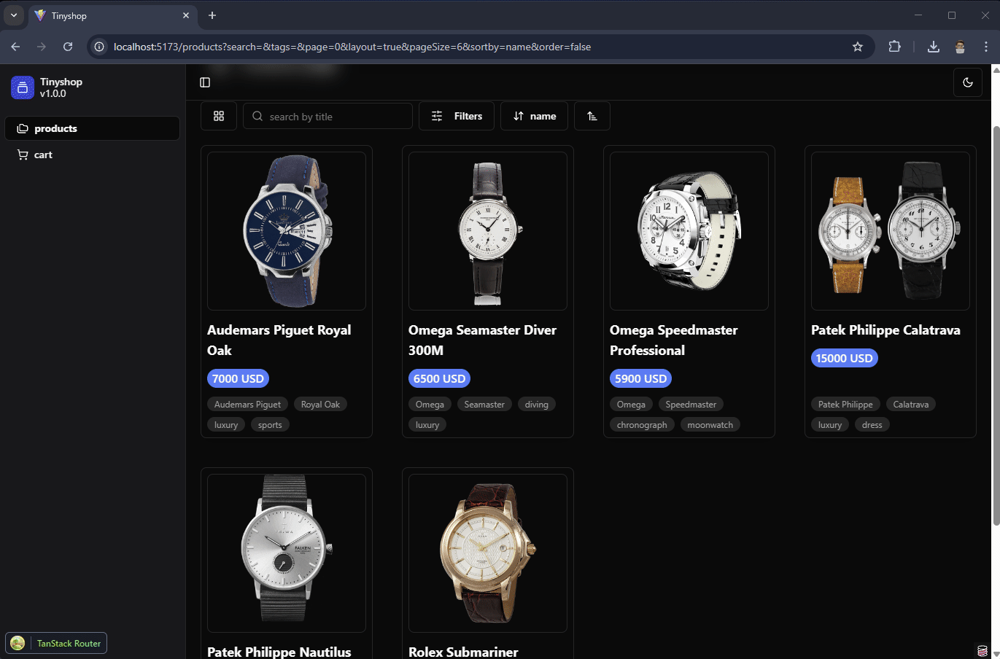

# Tinyshop

This project is a personal starter and showcase of using [Tinybase](https://tinybase.org/) and its features such as `Queries`, `Indexing`, and `Metrics` with [TanStack](https://tanstack.com/router/latest) powerful routing system to make an e-commerce application. It features search and pagination for grid or table view, products filter and actions, a shopping cart utilizing `Metrics` to do calculation, and checkout with total sums of added products.



## Technologies

- [TinyBase](https://tinybase.org/) with React for data storing and more.
- [Vite](https://vitejs.dev/) for lightning-fast development.
- [TanStack](https://tanstack.com/router/latest) powerful routing system with vite plugin to auto generate routes.
- [TailwindCSS](https://tailwindcss.com/) for utility-first styling.
- [Shadcn/UI](https://ui.shadcn.com/) for beautiful, customizable UI components found in `components/ui`.
- [React Aria Components](https://react-spectrum.adobe.com/react-aria/index.html) hands down best table functionality, make it easy to do all shift and ctrl select and manging headers for sorting.
- [lucide-react](https://lucide.dev/icons/)/[react-icons](https://react-icons.github.io/react-icons/) best icon library, i use it in every project.

## Key features:

Here's a summary of some files and its role:

- **`src/main.tsx`**

  - **Purpose:** The main entry point of the application. Initializes the TinyBase store, queries, indexes, metrics, the TanStack Router, and renders the application.

- **`forms-schema.ts`**
  - **Purpose**: Defines a Zod schema (`ProductsSearchSchema`) for validating and sanitizing product search parameters.
  - **Fields**: Specifies the expected data types and default values for search queries, tags, pagination (page, pageSize), layout preference, sorting (sortby, order). Uses `.catch()` to provide default values if the input is missing or invalid.

```typescript src/schema/forms-schema.ts
import { z } from "zod";

export const ProductsSearchSchema = z.object({
  search: z.string().catch(""),
  tags: z.string().catch(""),
  page: z.number().catch(0),
  layout: z.boolean().catch(true),
  pageSize: z.number().catch(6),
  sortby: z.string().catch("id"),
  order: z.boolean().catch(false),
});
```

- **`tinybase-schema.ts`**
  - **Purpose**: Defines the schema for a TinyBase database, specifying the structure and data types of tables and values and provides React hooks.
  - **`tablesSchema`**: Defines the structure of the `products` and `cart` tables, including column names and their data types (string, number).
  - **`valuesSchema`**: Defines the structure of global values like `version`, `year` and `open`, including data types and default values. `year` defaults to the current year.
  - **Exports TinyBase React hooks**: Wraps TinyBase UI React components with the defined schemas, making them type-safe and easier to use. It exports a large object containing typed React hooks and components, such as `useTable`, `useValue`, etc, to interact with the TinyBase store based on the declared schemas.

```typescript src/schema/tinybase-schema.ts
import { format } from "date-fns";
import * as UiReact from "tinybase/ui-react/with-schemas";

export const tablesSchema = {
  products: {
    name: { type: "string" },
    price: { type: "number" },
    image: { type: "string" },
    tags: { type: "string" },
    description: { type: "string" },
  },
  cart: {
    name: { type: "string" },
    price: { type: "number" },
    totalPrice: { type: "number" },
    image: { type: "string" },
    amount: { type: "number" },
  },
} as const;

export const valuesSchema = {
  version: { type: "string", default: "0.0.0" },
  year: { type: "string", default: format(new Date(), "y") },
  open: { type: "boolean", default: false },
} as const;
```

- **`src/constant/seed.tsx`**

  - **Purpose:** This file serves as a seed for populating [Tinybase](https://tinybase.org/) initial product data It provides a set of sample products to work with.

- **`src/components/products-page/products-grid.tsx`**

  - **Purpose:** Renders products in a grid layout.
  - **Functionality:**
    - Fetches product data (using [Tinybase](https://tinybase.org/) queries and [TanStack router](https://tanstack.com/router/) search parameters for sorting, ordering, pagination).
    - Displays products as clickable cards/links.
    - Handles "no results" display when no products match the search criteria.
    - Uses the `ResultRowView` component to display the product data, using a `CustomCell` component for specialized rendering.

- **`src/components/products-page/products-table.tsx`**

  - **Purpose:** Renders products in a tabular format with sorting and selection capabilities.
  - **Functionality:**
    - Fetches product data (using [Tinybase](https://tinybase.org/) queries and [TanStack router](https://tanstack.com/router/) search parameters for sorting, ordering, pagination).
    - Displays products in a table, using custom components for header and cell rendering
    - Includes a toolbar (`ProductsToolBar`) for product selection and actions.
    - Uses [React Aria Components](https://react-spectrum.adobe.com/react-aria/index.html) for table structure and interactions (sorting, selection).
    - Handles "no results" display when no products match the search criteria.
    - Uses `ResultRowView` and `CustomCell` for data display.

- **`src/components/products-page/product-action.tsx`**

  - **Purpose:** Provides actions that can be performed on individual products (e.g., view details, add to cart).
  - **Functionality:**
    - Displays a menu of actions for each product (using [React Aria Components](https://react-spectrum.adobe.com/react-aria/index.html) for menu).
    - Includes options to navigate to the product detail page and add the product to the cart.
    - Uses a dialog/modal to allow the user to adjust the quantity before adding to cart.
    - Uses TinyBase's `useSetPartialRowCallback` to add product data to a "cart" table/store.
    - Displays a toast notification upon successful addition to the cart.

- **`src/components/products-page/products-filter.tsx`**

  - **Purpose:** Implements filtering and sorting controls for the product list.
  - **Functionality:**
    - Displays filter options, such as tags, as buttons.
    - Toggles tags and sort by parameters in the URL.
    - Updates the [TanStack router](https://tanstack.com/router/) search parameters to reflect the selected filters and sorting options.
    - Uses `useSliceIds` to display unique tag values.
    - Uses Popover for a clean UI.

- **`src/components/products-page/products-search.tsx`**

  - **Purpose:** Implements the product search functionality.
  - **Functionality:**
    - Provides a search input field.
    - Uses `useDebouncedCallback` to delay the search execution until the user stops typing.
    - Updates the [TanStack router](https://tanstack.com/router/) search parameters to reflect the search term.
    - Uses a TinyBase `setQueryDefinition` to filter and order the displayed products based on search parameters.
    - Clears the query when the component unmounts.

- **`src/components/products-page/products-toolbar.tsx`**

  - **Purpose:** Provides a toolbar for actions related to selected products in the table.
  - **Functionality:**
    - Displays actions that can be performed on selected products, such as adding them to the cart.
    - Manages the selected product keys (`selectedKeys` prop).
    - Includes a button to unselect all selected products.
    - Updates the "cart" table in TinyBase with the selected products.

- **`src/components/products-page/procuts-paginator.tsx`**

  - **Purpose:** Implements pagination controls for navigating through the product list.
  - **Functionality:**
    - Displays "Previous" and "Next" buttons.
    - Updates the [TanStack router](https://tanstack.com/router/) search parameters to reflect the current page number.
    - Disables the "Previous" and "Next" buttons when at the first or last page, respectively.
    - Shows current page number and total pages

### Development Setup

1. **Installation**
   Install the project dependencies:

   ```bash
   npm install
   ```

2. **Development Server**

   Start the Vite development server with hot modules:

   ```bash
   npm run dev
   ```

3. **Building**

   Build and run the production build using:

   ```bash
   npm run build
   ```

---

> find me on x [@mouktardev](https://x.com/mouktardev) and on [instagram](https://www.instagram.com/mouktardev/) or [threads](https://www.threads.net/@mouktardev)
